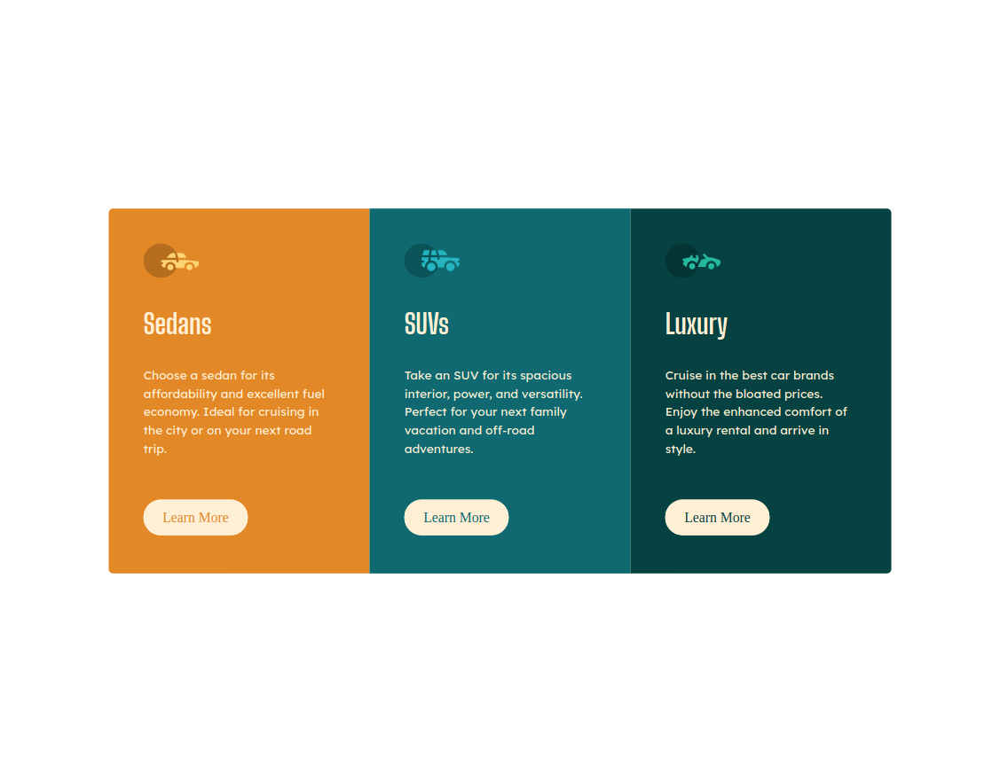
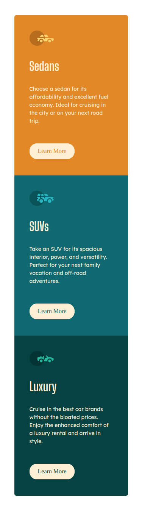

# Frontend Mentor - 3Column Card Component

  

## 🚀 Descrição
Projeto resolvido usando técnicas de flexbox. 
Veja o projeto de forma interativa: [VISITE](https://3column-kev.netlify.app/)

## 🖥️ preview final do projeto

  

## 📳 preview final do projeto mobile

  

