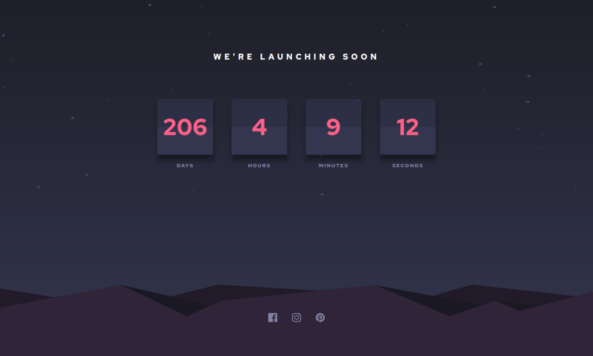

# Frontend Mentor - Countdown Timer

  

## 🚀 Descrição
Foi muito divertido codar esse projeto, mas apesar de considerá-lo finalizado por enquanto ainda pretendo voltar nele para fazer a animação do card a cada troca de segundo, bem como refatorar o que for necessário. 
Veja o projeto de forma interativa: [VISITE](https://countdown-kev.netlify.app/)

## 🖥️ preview final do projeto

  

## 📳 preview final do projeto mobile

  

