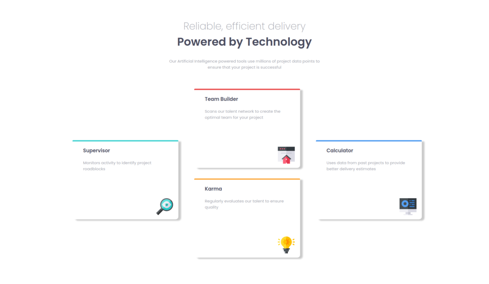

# Frontend Mentor - Four Card Feature Section

  

## 🚀 Descrição
Projeto desenvolvido utilizando HTML e SasS CSS. 
Veja o projeto de forma interativa: [VISITE](https://four-card-kev.netlify.app/)

## 🖥️ preview final do projeto

  

## 📳 preview final do projeto mobile

  

