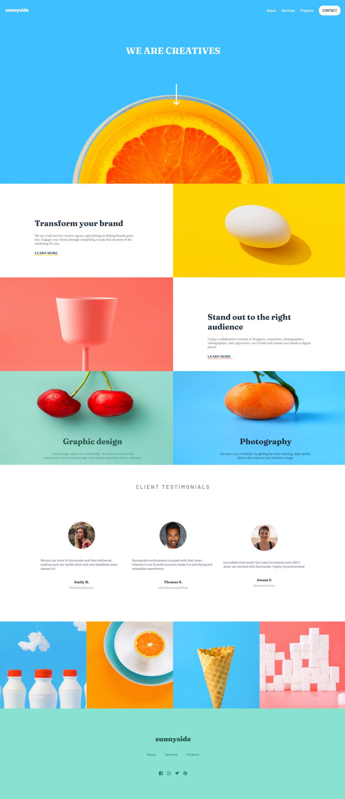
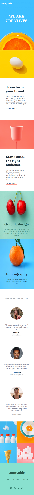

# Frontend Mentor - Sunnyside Agency Landing Page

  

## 🚀 Descrição
Projeto desenvolvido utilziando HTML, SasS Css e Javascript.  
Verifique o projeto de forma interativa: [Click Aqui!](https://sunnyside-kev.netlify.app/)

## 🖥️ preview final do projeto

  

## 📳 preview final do projeto mobile

  

